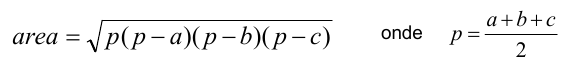
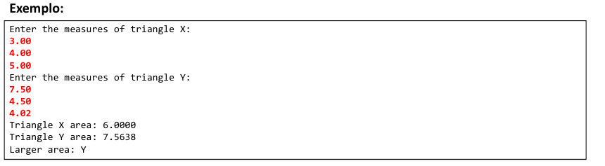
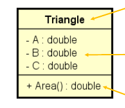

### App001

Fazer um programa para ler as medidas dos lados de dois triângulos X e Y (suponha medidas válidas).

Em seguida, mostrar o valor das áreas dos dois triângulos e dizer qual dos dois triângulos possui a maior área.

A fórmula para calcular a área de um triângulo a partir das medidas de seus lados A, B e C é a seguinte (fórmula de Heron):

**UML**

