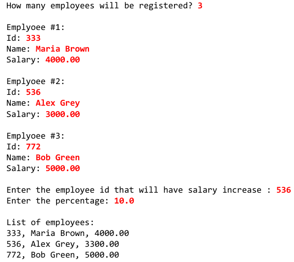
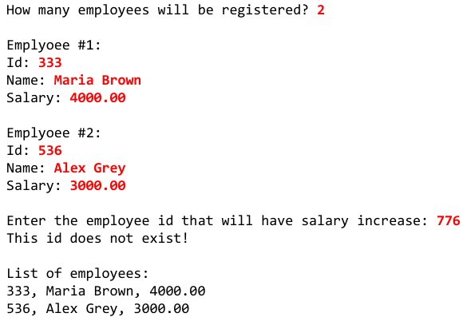
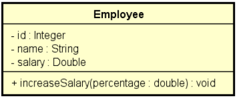

### App007

Fazer um programa para ler um número inteiro N e depois os dados (id, nome e salario) de N funcionários.

Não deve haver repetição de id.

Em seguida, efetuar o aumento de X por cento no salário de um determinado funcionário.

Para isso, o programa deve ler um id e o valor X.

Se o id informado não existir, mostrar uma mensagem e abortar a operação.

Ao final, mostrar a listagem atualizada dos funcionários, conforme exemplos.

Lembre-se de aplicar a técnica de encapsulamento para não permitir que o salário possa ser mudado livremente.

Um salário só pode ser aumentado com base em uma operação de aumento por porcentagem dada.

**Exemplo 1:**

**Exemplo 2:**

**UML**

