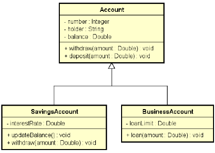

### App011

1 - Suponha que a operação de saque possui uma taxa no valor de 5.0.

Entretanto, se a conta for do tipo poupança, esta taxa não deve ser cobrada.

Como resolver isso?

Resposta: sobrescrevendo o método withdraw na subclasse SavingsAccount

2 - Suponha que, na classe BusinessAccount, a regra para saque seja realizar o saque normalmente da superclasse, e descontar mais 2.0.

**UML**

